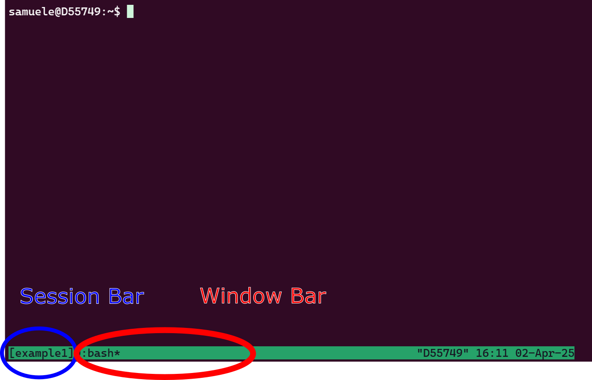
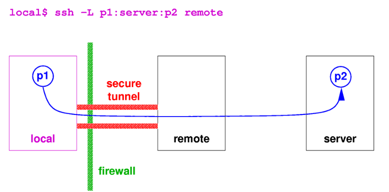
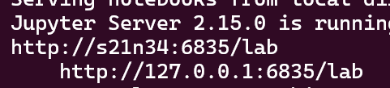
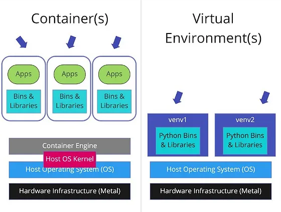
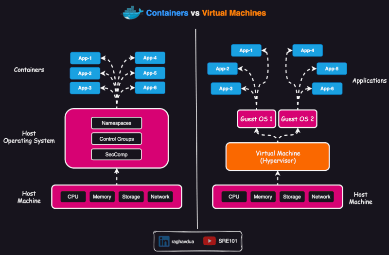

# Some background

- These slides are both a presentation and a small reference manual

- 90% of slides are you doing stuff - so open your terminals

- Official reference documentation: [genome.au.dk](https://genome.au.dk)

- Some advanced things require a bit of practice/frustration, but I hope to reduce it

- Most important message before starting any workshop: [RTFM - Read The Freaking Manual!](https://idratherbewriting.com/2012/08/30/the-blame-game-of-rtfm/). Though
  - Some manuals are really useless, but the ones for UNIX tools are pretty good
  - Unusual options might be buried somewhere or badly explained

## When you need to ask for help

- **Practical help:** 
  
  Samuele (BiRC, MBG) - samuele@birc.au.dk 

- **Drop in hours:**

  - Bioinformatics Cafe: [https://abc.au.dk](abc.au.dk), abcafe@au.dk
  - Samuele (BiRC, MBG) - samuele@birc.au.dk - we just set up a meeting/zoom

- **General mail for assistance**

  support@genome.au.dk

## Program

- **10:00-10:20**: 
  - Workshop Introduction
  - Some everyday things for your home folder
    - and your mental sanity

- **10:20-11:00**: 
  - `rsync` copy and backups, terminals on `tmux`
  - cake break

- **11:10-12:00**: 
  - Web applications, ports and tunnels
  - Containers (Docker, singularity)

- **12:45-13:15**: 
  - Batch jobs

- **13:15-14:00**: 
  - Your first pipeline with `gwf`, `pixi` and `containers`

## Get the slides

Webpage: [https://hds-sandbox.github.io/GDKworkshops/](https://hds-sandbox.github.io/GDKworkshops/)


## Navigate the slides

{fig-align="center"}


** Keep slides + a terminal open for the workshop{.smaller}**


# Syncronizations, downloads, multiple terminals

- How to download/update incrementally using `rsync`
- Use `rsync` to create backups and versioning
- Create and navigate multiple sessions with `tmux`
- Launch parallel background downloads with `tmux`

## transfer and sync with `rsync`

`tmux` is a very versatile tool for

- transfering **from remote to local** host (and viceversa)
- copying from **local to local** host (e.g. data backups/sync) 
- transfering only files which has changed from last copy (**incremental copy**)

:::{.callout-warning}
`rsync` cannot make a transfer between two remote hosts, e.g. running from your PC to transfer data between GenomeDK and Computerome.
:::

Lots of options you can find in the manual (would require a workshop only for that)

<div style="text-align: center; margin-top: 20px;">
  <a href="https://linux.die.net/man/1/rsync" target="_blank" style="display: inline-block; padding: 10px 20px; background-color: #007BFF; color: white; text-decoration: none; border-radius: 5px; border: 2px solid #0056b3; font-weight: bold;">
    rsync manual
  </a>
</div>

## Exercise

Log into GenomeDK. Create anywhere you prefere a folder called `advancedGDK` containing
`rsync/data`

```{.bash}
mkdir -p advancedGDK/rsync/data
cd advancedGDK/rsync
```

Create 100 files with extensions `fastq` and `log` in the data folder

```{.bash}
touch data/file{1..100}.fastq data/file{1..100}.log
```

---

### Local-to-local copy

:::{.callout-note}
The syntax of `rsync` is pretty simple:

```
rsync OPTIONS ORIGIN(s) DESTINATION
```
:::

&nbsp;

An archive (incremental) copy can be done with the options `a`. You can add a progress bar with `P`. You can exclude files: here we want only the ones with `fastq` extension. Run the command

```{.bash}
rsync -aP --exclude="*.log" data backup
```

This will copy all the `fastq` files in `backup/data`. You can check with `ls`.

:::{.callout-warning}
Using `data` will copy the entire folder, while `data/` will copy only its content! This is common to many other UNIX tools.
:::

---

Change the first ten `fastq` files with some text:

```{.bash}
for i in {1..10}; do echo hello >> data/file$i.fastq; done
```

Now, we do not only want to do an incremental copy of those file with `rsync`, but also keep the previous version of those files. We create a folder to backup those, naming it with date and time (you will find it in your `backup` directory):

```{.bash}
rsync -aP --exclude="*.log" \
      --backup \
      --backup-dir=versioning_$(date +%F_%T)/ \
      data \
      backup
```

:::{.callout-tip}

If you create a folder called `backup` in your project folder, you can use versioning to store your analysis and results with incremental changes.

:::

**Exercise finished**

---

### Transfer between local and remote

You can in the same way transfer and backup data between your local host (your PC, or GenomeDK) and another remote host (another cluster). You need Linux or Mac on the local host.
For example, to get on your computer the same `fastq` files:

```{.bash}
rsync -aP --exclude="*.log" USERNAME@login.genome.au.dk:PATH_TO/advancedGDK/data PATH_TO/backup
```

The opposite can be done uploading data from your computer. For example:

```{.bash}
rsync -aP --exclude="*.log" PATH_TO/data USERNAME@login.genome.au.dk:PATH_TO/backup
```

&nbsp;

All `rsync` options will work as usual in these cases. You need to type your password if you do not make use of `ssh` keys.


## multiple terminals with `tmux`

With `tmux` you can 

- start a server with multiple **sessions**
- each session containing one or more **windows with multiple terminals (panes)**
- each terminal run simultaneously and be accessed **(attached)** or exited from **(detached)**
- the tmux server keeps runninng **without a logged user**


{fig-align="center" width=400px}

---

## Exercise

`tmux` was a keyboard-only software. But you can set it up also to change windows and panes with the mouse. Simply write this setting on the configuration file:

```{.bash}
echo "set -g mouse" >> ~/.tmux.conf
```

You can start a `tmux` session anywhere. It is easier to navigate sessions giving them a name.
For example start a session called `example1`:

```{.bash}
tmux new -s example1
```

---

The command will set you into the session automatically. The window looks something like below:

{fig-align="center" width=600px}

---

Now, you are in session `example1` and have one window, which you are using now. You can split the window in multiple terminals. Try both those combinations of buttons:

```
Ctrl + b + %

Ctrl + b + ""
```

Or keep right-clicked with the mouse to choose the split.

Do split the window horizontally and vertically, running 3 terminals. You can select any of them with the mouse (left-click).

Try to select a window and resize it: while keeping `Ctrl + b` pressed, use the arrows to change the size

---

Now, you have your three panes running in a window.

Create a new window with `Ctrl + b + c`. Or keep right-clicked on the window bar and create a new window.

You should see another window added in the bottom window bar. Again, switch between windows with your mouse (left-click!

In the new window, let's look at which tmux sessions and windows are open. Run

```{.bash}
tmux ls
```

The output will tell you that session `example1` is in use (attached) and has 2 windows. Something like this:

```
example1: 2 windows (created Wed Apr  2 16:12:54 2025) (attached)
```

---

### Launching separate downloads at the same time
Start a new session without attaching to it (`d` option), and call it `downloads`:

```{.bash}
tmux new-session -d -s downloads
```

verify the session is there with `tmux ls`.

:::{.callout-warning}
If you want a new session attaching to it, you need to detach from the current session with `Ctrl + b + d`.
:::

Create a text file with few example files for this workshop to be downloaded.

```{.bash}
curl -s https://api.github.com/repos/hds-sandbox/GDKworkshops/contents/Examples/rsync | jq -r '.[] | .download_url' > downloads.txt
```

---

Now, the script below launches all the URLs from the list in the download session in a new window. The new window closes after the download. If there are less than K downloads active, a new one starts, until the end! You can use this and close your terminal. The downloads will keep going and the window names will be shown to keep an eye on the current downloads. Try it out and use it whenever you have massive number of file downloads.

```{.bash}
mkdir -p downloaded
K=2  # Maximum number of concurrent downloads
while read -r url; do
    # Wait until the number of active tmux windows in the "downloads" session is less than K
    while [ "$(tmux list-windows -t downloads | wc -l)" -ge "$((K+1))" ]; do     
        sleep 1
    done

    # Extract the filename from the URL
    filename=$(basename "$url")

    # Start a new tmux window for the download
    tmux new-window -t downloads -n "$filename" "wget -c $url -O downloaded/$filename && tmux kill-window"
    tmux list-windows -t downloads -F "#{window_name}"   
done < downloads.txt
```

# Web applications, ports, tunneling

## Web applications

Why do we use web applications for graphical interfaces?

- all the graphics heavy-lifting is done by the browser
- before, the X11 forwarding was the way to do graphics from remote
- problem: X11 sends the whole graphics over the network, which is slow

[We have written a bit about that on one of our ABC tutorials](https://abc.au.dk/documentation/2024-11-28-ABC9.html)

---

A web application on GenomeDK:

- starts a **server process** on the cluster
- This server listens for incoming requests on a specific **port**
- The server sends and receives data over the network via the port.

&nbsp;


The local user:

- creates a **tunnel**, which is an `ssh` connection mapping to the remote port used by the server process

---

{fig-align="center" width=800px}

---

### Which port to use

- Each server process on a machine needs a **unique port** (p2 on previous figure) to avoid conflicts.

- Ports are in common between users on GenomeDK. So you can only use the port corresponding to your user number, which you can see with
  
  `echo $UID`

- You will see all this in the next exercise

:::{.callout-warning title="better safe than sorry"}
Launch a web application which has tokens (a random code in the URL for the browser) or a password. In theory, anyone on your same node of the cluster can get into your server process and see your program and data!
:::

## Exercise: jupyterlab web server{.scrollable}

If you DO NOT have the `conda` package manager, you can quickly install it from the box below, otherwise move to the next slide!

:::{.callout-tip title="Install conda" collapse="true"}
Run the installation script to install the software. There are some informative messages during the installation. You might need to say `yes` a few times

```{.bash}
wget https://github.com/conda-forge/miniforge/releases/latest/download/Miniforge3-Linux-x86_64.sh -O miniforge.sh
chmod +x miniforge.sh
bash miniforge.sh -b
~/miniforge3/bin/conda init bash
source ~/.bashrc
```

When you are done, you need a little bit of configuration. You can run the following command to configure `conda` (run them only once, they are not needed again):

```{.bash}
conda config --append channels conda-forge
conda config --append channels bioconda
conda config --set channel_priority strict
conda config --set auto_activate_base false
source ~/.bashrc
```

Finally, install a package to accellerate `conda`. This is optional but recommended:

```{.bash}
conda install -n base --yes conda-libmamba-solver
conda config --set solver libmamba
```

Now you are ready to move on!

:::

---

On GenomeDK, create a new `tmux` session:

```{.bash}
tmux new -s jupyterlab
```

&nbsp;

and create a new `conda` environment:

```{.bash}
conda create -y -n GDKjupyter conda-forge::jupyterlab conda-forge::numpy conda-forge::pandas
```

&nbsp;

Start a job with just a few resources. This will always keep running until the end since it is inside a tmux session!

```{.bash}
srun --mem=8g --cores=1 --time=4:00:0  --account=YOUR_PROJECT --pty /bin/bash
```

&nbsp;

Now activate your environment and run jupyterlab. You will need the node name and your user ID. Those can be given as variables to the web server using  `$(hostname)` and $UID:

```{.bash}
conda activate GDKjupyter
jupyter-lab --port=$UID \
  --ip=$(hostname) \
  --no-browser
```

---

You will see some messages and recognize an address with: your node and your user ID. Below it, the URL you can use in your browser. It will look like this, but in your case it might have an added token in the URL (mine is instead password protected):

{fig-align="center" width=400px}

&nbsp;

**We still need a tunnel** from the local host (your PC)! keep note of the port and node, and write in a new terminal **(not logged into GenomeDK)** a command like the one below (matching the example figure above):

```{.bash}
ssh -L6835:s21n34:6835 USERNAME@login.genome.au.dk
```

:::{.callout-note}
In the command above I prefere to map the same ports locally and remotely, but you can use two different port.

If you do not have passwordless login, you have to write the password. 
:::

Your tunnel will be opened. Now the web application can be accessed from your browser at the address given by the server process on GenomeDK (put your correct port number).

**Exercise finished**

---

:::{.callout-tip}
The same logic applies to all other web applications. They will have similar options to define the remote node and port. 

Usually the host node option changes name between `ip`, `host`, `address`, or `hostname`.
:::


# Containers

:::{.callout-note}
**Container = ** Standalone and portable software package including 

- code 
- runtime
- libraries
- system tools
- operating system-level dependencies
:::

&nbsp;

Deployement of a container on different HPCs and PCs is reproducible. A virtual environment (conda, mamba, pixi, cargo, npm, ...) depends on the host system and is not fully reproducible.

## Container vs virtual env vs VM

A **virtual environment** isolates dependencies for a specific programming language within the same operating system. It does not include the operating system or system-level dependencies, so it depends on the hosting system.

{fig-align="center" width="600px"}

---

- A **virtual machine (VM)** virtualizes an entire operating system, including the kernel, and runs on a hypervisor (assigns resources to the VM).

{fig-align="center" width="600px"}

## Scope of containers

- Containers are usually thought as packing a specific application which can run anywhere (or, which is portable).

- E.g. annoying bioinformatics software requiring specific libraries or long installations.

- Many containers are done with *Docker*, but this is not installed on GenomeDK

- GenomeDK has *Singularity*, which can also run programs installed in Docker containers.

- Very practical to pull and use containers in workflows.

## Where to find containers?

Typical repositories with pre-built containers are:

- **[Biocontainers](https://biocontainers.pro)**: community-driven initiative to containerize bioinf softwares.
  - >10K tools >100K containers
  - [bioconda package index](https://bioconda.github.io/conda-package_index.html) lists all software versions
  - the [Registry page](https://biocontainers.pro/registry) has a searchable interface to find what you need

- **[DockerHub](https://hub.docker.com/)** registry: Public hub for Docker images, often including official containers from software developers

- **[Quay](https://quay.io/)**: Same philosophy of DockerHub.

Once you find a container on the websites, simply use the provided code to pull it locally.

## Exercise I: web applications and tunneling


We try to run `rocker-RStudio`, which stems from a project trying to containerize Rstudio server. 

&nbsp;

[Look at the webpage](https://hub.docker.com/r/rocker/rstudio) from DockerHub, and note that they provide only the Docker command to pull the container. 

Singularity is slightly different, we will pull the container with it.

---

Start a new session on tmux (remember to detach from a previous session):

```{.bash}
tmux new -s rstudio
```

Make `advancedGDK` your current directory, and create one for Rstudio:

```{.bash}
mkdir rstudio
cd rstudio
```

First of all, empty the cache of `singularity`. This can be quickly too large.


---

Now, create one more session with its own windows for running containers on interactive jobs: detach from the current session using `Ctrl + b + d`.

Create now a new session called `containers`.

```{.bash}
tmux new -s containers
```

and verify you have three sessions using `tmux ls`. Try to move between sessions using `Ctrl + b + )` and `Ctrl + b + (`. Or keep right-clicked on the session name and choose Next/Previous.


# Closing the workshop

Please fill out this form :)

<iframe src="AAAhttps://docs.google.com/forms/d/e/1FAIpQLSfImYVZLrmBG_Z54sy1Au_jRwneg4Pjnenh36J34x9SYttSoQ/viewform?embedded=true" width="640" height="640" frameborder="0" marginheight="0" marginwidth="0">Indlæser…</iframe>

---

- A lot of things we could not cover

- use the official documentation! 

- ask for help, use drop in hours ([ABC cafe](https://abc.au.dk))

- try out stuff and google yourself out of small problems
  
- Slides updated over time, use as a reference

- Next workshop all about pipelines