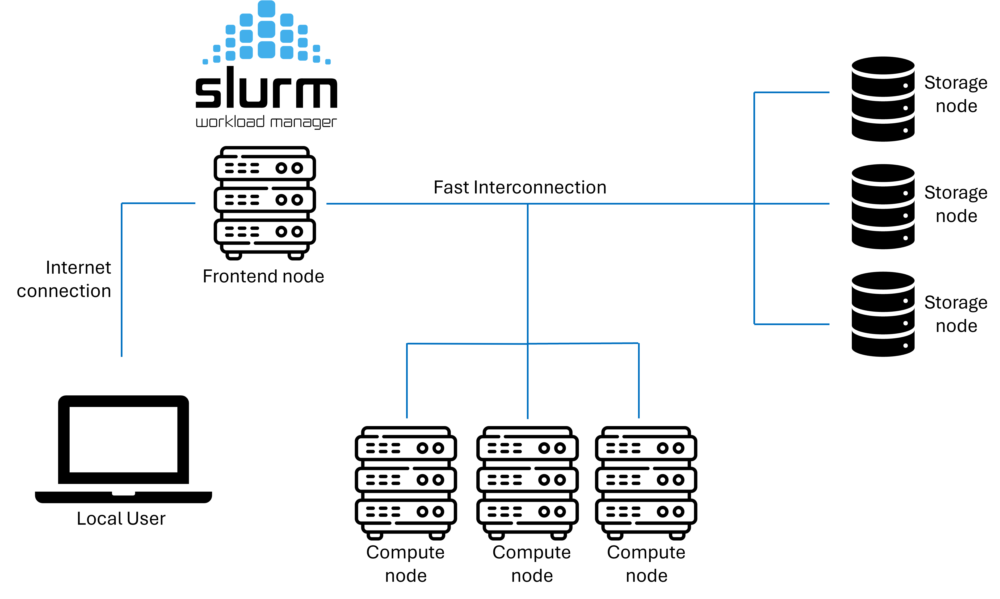
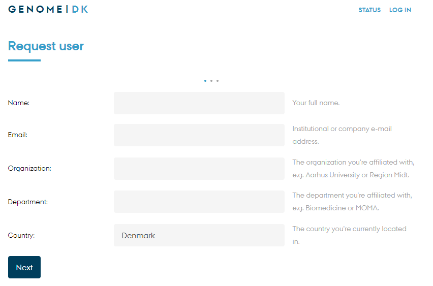

# Some background

- These slides are both a presentation and a small reference manual

- We will try out some commands during the workshop

- Official reference documentation: [genome.au.dk](https://genome.au.dk)

## When you need to ask for help

- **Practical help:** 
  
  Samuele (BiRC, MBG) - samuele@birc.au.dk 

- **Drop in hours:**

  - Bioinformatics Cafe: [https://abc.au.dk](abc.au.dk), abc@au.dk
  - Samuele (BiRC, MBG) - samuele@birc.au.dk

- **General mail for assistance**

  support@genome.au.dk

## Program

- **10:00-10:15**: Workshop Introduction, questions 

- **10:15-11:00**: 
  - `rsync` download and synchronization
  - multiple virtual terminals on `tmux`
  - cake break

- **11:10-12:00**: 
  - Web applications, ports, certificates
  - Containers (Docker, singularity)

- **12:45-13:15**: 
  - Batch jobs

- **13:15-14:00**: 
  - A pipeline with `gwf`, `pixi` and `containers`

## Get the slides

Webpage: [https://hds-sandbox.github.io/GDKworkshops/](https://hds-sandbox.github.io/GDKworkshops/)


## Navigate the slides

{fig-align="center"}


** Keep slides + a terminal open for the workshop{.smaller}**


# Syncronizations, downloads, multiple terminals

- How to download/update incrementally using `rsync`
- Use `rsync` to create backups and versioning
- Create multiple terminals in the same session with `tmux`
- Launch parallel downloads with `rsync` + `tmux`

## transfer and sync with `rsync`

Very versatile tool for

- transfering **from remote to local** host (and viceversa)
- copying from **local to local** host (e.g. data backups/sync) 
- transfering only files which has changed from last copy (**incremental copy**)

:::{.callout-warning}
`rsync` cannot make a transfer between two remote hosts, e.g. running from your PC to transfer data between GenomeDK and Computerome.
:::

Lots of options you can find in the manual (would require a workshop only for that)

<div style="text-align: center; margin-top: 20px;">
  <a href="https://linux.die.net/man/1/rsync" target="_blank" style="display: inline-block; padding: 10px 20px; background-color: #007BFF; color: white; text-decoration: none; border-radius: 5px; border: 2px solid #0056b3; font-weight: bold;">
    rsync manual
  </a>
</div>


## Infrastructure

`GenomeDK` is a **computing cluster**, i.e. a set of interconnected computers (nodes). `GenomeDK` has:

- **computing nodes** used for running programs (~15000 cores)
- **storage nodes** storing data in many hard drives (~23 PiB)
- a **network** making nodes talk to each other
- a **frontend** node from which you can send your programs to a node to be executed
- a **queueing system** called *slurm* to prioritize the users' program to be run

---

{fig-align="center"}

## Access 

- **Creating an account** happens through [this form](https://console.genome.au.dk/user-requests/create/) at genome.au.dk

    {width=600px fig-alig="center"}

---

- **Logging into GenomeDK** happens through the command ^[both in Linux/Mac terminal and Windows Powershell. Powershell might require `ssh.exe` instead of `ssh`]

    ```{.bash}
    [local]$  ssh USERNAME@login.genome.au.dk
    ```

- When first logged in, **setup the 2-factor authentication** by 
    - showing a QR-code with the command

        ```{.bash}
        [gdk]$  gdk-auth-show-qr
        ```
    - scanning it with your phone's Authenticator app ^[e.g. Microsoft Authenticator, Google Authenticator, ...].


# Closing the workshop

Please fill out this form :)

<iframe src="https://docs.google.com/forms/d/e/1FAIpQLSfImYVZLrmBG_Z54sy1Au_jRwneg4Pjnenh36J34x9SYttSoQ/viewform?embedded=true" width="640" height="640" frameborder="0" marginheight="0" marginwidth="0">Indlæser…</iframe>

---

- A lot of things we could not cover

- use the official documentation! 

- ask for help, use drop in hours

- try out stuff and google yourself out of small problems
  
- Slides updated over time, use as a reference

- Future workshops about advanced usage and pipelines