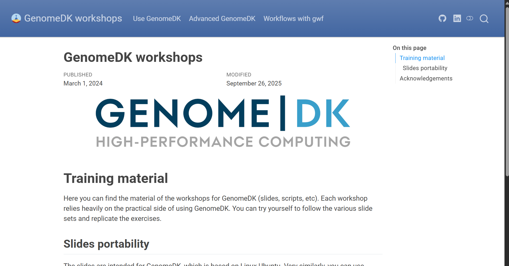
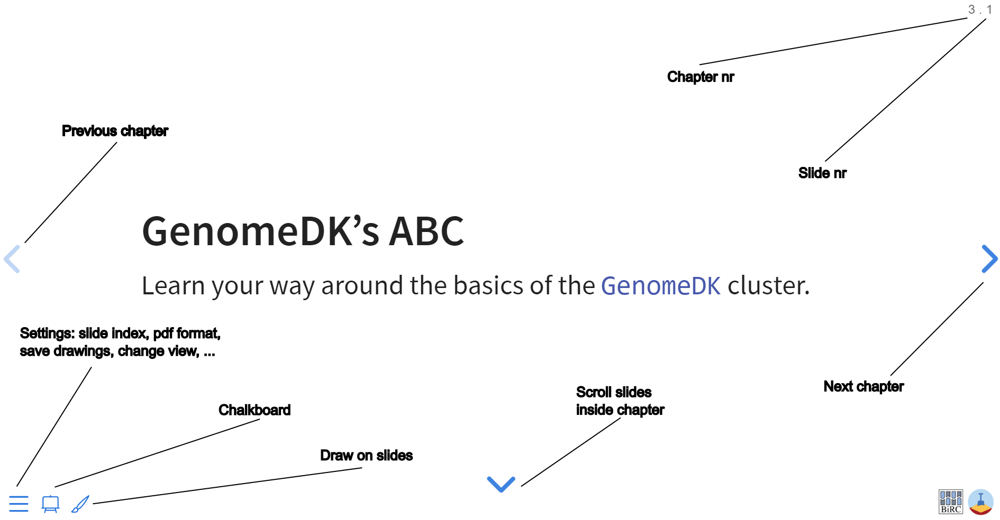
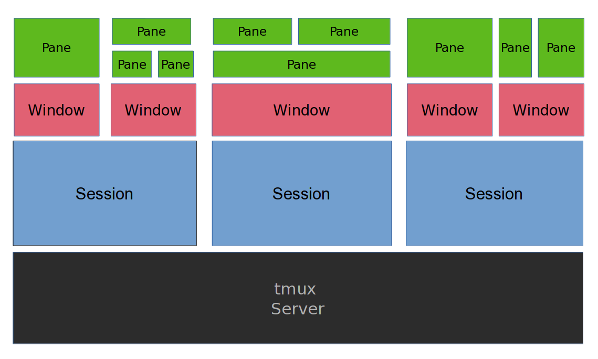

# Some background

- These slides are both a presentation and a small reference manual

- We will try out some commands during the workshop

- Official reference documentation: [genome.au.dk](https://genome.au.dk)

## When you need to ask for help

- **Practical help:** 
  
  Samuele (BiRC, MBG) - samuele@birc.au.dk 

- **Drop in hours:**

  - Bioinformatics Cafe: [https://abc.au.dk](abc.au.dk), abc@au.dk
  - Samuele (BiRC, MBG) - samuele@birc.au.dk

- **General mail for assistance**

  support@genome.au.dk

## Program

- **10:00-10:15**: Workshop Introduction, questions 

- **10:15-11:00**: 
  - `rsync` download and synchronization
  - multiple virtual terminals on `tmux`
  - cake break

- **11:10-12:00**: 
  - Web applications, ports, certificates
  - Containers (Docker, singularity)

- **12:45-13:15**: 
  - Batch jobs

- **13:15-14:00**: 
  - A pipeline with `gwf`, `pixi` and `containers`

## Get the slides

Webpage: [https://hds-sandbox.github.io/GDKworkshops/](https://hds-sandbox.github.io/GDKworkshops/)



## Navigate the slides

{fig-align="center"}


** Keep slides + a terminal open for the workshop{.smaller}**


# Syncronizations, downloads, multiple terminals

- How to download/update incrementally using `rsync`
- Use `rsync` to create backups and versioning
- Create multiple terminals in the same session with `tmux`
- Launch parallel downloads with `rsync` + `tmux`

## transfer and sync with `rsync`

`tmux` is a very versatile tool for

- transfering **from remote to local** host (and viceversa)
- copying from **local to local** host (e.g. data backups/sync) 
- transfering only files which has changed from last copy (**incremental copy**)

:::{.callout-warning}
`rsync` cannot make a transfer between two remote hosts, e.g. running from your PC to transfer data between GenomeDK and Computerome.
:::

Lots of options you can find in the manual (would require a workshop only for that)

<div style="text-align: center; margin-top: 20px;">
  <a href="https://linux.die.net/man/1/rsync" target="_blank" style="display: inline-block; padding: 10px 20px; background-color: #007BFF; color: white; text-decoration: none; border-radius: 5px; border: 2px solid #0056b3; font-weight: bold;">
    rsync manual
  </a>
</div>

## Exercise

Log into GenomeDK. Create anywhere you prefere a folder called `advancedGDK` containing
`rsync/data`

```{.bash}
mkdir -p advancedGDK/rsync/data
cd advancedGDK/rsync
```

Create 100 files with extensions `fastq` and `log` in the data folder

```{.bash}
touch data/file{1..100}.fastq data/file{1..100}.log
```

---

### Local-to-local copy

:::{.callout-note}
The syntax of `rsync` is pretty simple:

```
rsync OPTIONS ORIGIN(s) DESTINATION
```
:::

&nbsp;

An archive (incremental) copy can be done with the options `a`. You can add a progress bar with `P`. You can exclude files: here we want only the ones with `fastq` extension. Run the command

```{.bash}
rsync -aP --exclude="*.log" data backup
```

This will copy all the `fastq` files in `backup/data`. You can check with `ls`.

:::{.callout-warning}
Using `data` will copy the entire folder, while `data/` will copy only its content! This is common to many other UNIX tools.
:::

---

Change the first ten `fastq` files with some text:

```{.bash}
for i in {1..10}; do echo hello >> data/file$i.fastq; done
```

Now, we do not only want to do an incremental copy of those file with `rsync`, but also keep the previous version of those files. We create a folder to backup those, naming it with date and time (you will find it in your `backup` directory):

```{.bash}
rsync -aP --exclude="*.log" \
      --backup \
      --backup-dir=versioning_$(date +%F_%T)/ \
      data \
      backup
```

:::{.callout-tip}

If you create a folder called `backup` in your project folder, you can use versioning to store your analysis and results with incremental changes.

:::

**Exercise finished**

---

### Transfer between local and remote

You can in the same way transfer and backup data between your local host (your PC, or GenomeDK) and another remote host (another cluster). You need Linux or Mac on the local host.
For example, to get on your computer the same `fastq` files:

```{.bash}
rsync -aP --exclude="*.log" USERNAME@login.genome.au.dk:PATH_TO/advancedGDK/data PATH_TO/backup
```

The opposite can be done uploading data from your computer. For example:

```{.bash}
rsync -aP --exclude="*.log" PATH_TO/data USERNAME@login.genome.au.dk:PATH_TO/backup
```

&nbsp;

All `rsync` options will work as usual in these cases. You need to type your password if you do not make use of `ssh` keys.


## multiple terminals with `tmux`

With `tmux` you can 

- start a server with multiple **sessions**
- each session containing one or more **windows with multiple terminals (panes)**
- each terminal run simultaneously and be accessed **(attached)** or exited from **(detached)**
- the tmux server keeps runninng **without a logged user**


{fig-align="center" width=400px}

---

## Exercise

`tmux` was a keyboard-only software. But you can set it up also to change windows and panes with the mouse. Simply write this setting on the configuration file:

```{.bash}
echo "set -g mouse" >> ~/.tmux.conf
```

You can start a `tmux` session anywhere. It is easier to navigate sessions giving them a name.
For example start a session called `example1`:

```{.bash}
tmux new -s example1
```

---

The command will set you into the session automatically. The window looks something like below:

---

Now, you are in session `example1` and have one window, which you are using now. You can split the window in multiple terminals. Try both those combinations of buttons:

```
Ctrl + b + %

Ctrl + b + ""
```

You will split the window horizontally and vertically, running 3 terminals. You can interact with any of them with the mouse.

Try to select a window and resize it: while keeping `Ctrl + b` pressed, use the arrows to change the size

---

Now, you have your three panes running in a window.

Create a new window with `Ctrl + b + c`

You should see another window added in the bottom window list. Again, switch between windows with your mouse!

In the new window, let's look at which tmux sessions and windows are open. Run

```{.bash}
tmux ls
```

The output will tell you that session `example1` is in use (attached) and has 2 windows. Something like this:

```
example1: 2 windows (created Wed Apr  2 16:12:54 2025) (attached)
```

---

Now, imagine this session is the one to do things on the front-end node (managing folders, ...). You would like one more session with its own windows for running containers on interactive jobs.

:::{.callout-warning}
Remember you always need to detach you from a session to create a new one! 

Detach from the current session using `Ctrl + b + d`.
:::

Create now a new session called `containers`.

```{.bash}
tmux new -s containers
```

and verify you have two sessions using `tmux ls`. Try to move between sessions using `Ctrl + b + )` and `Ctrl + b + (`.


# Closing the workshop

Please fill out this form :)

<iframe src="AAAhttps://docs.google.com/forms/d/e/1FAIpQLSfImYVZLrmBG_Z54sy1Au_jRwneg4Pjnenh36J34x9SYttSoQ/viewform?embedded=true" width="640" height="640" frameborder="0" marginheight="0" marginwidth="0">Indlæser…</iframe>

---

- A lot of things we could not cover

- use the official documentation! 

- ask for help, use drop in hours ([ABC cafe](https://abc.au.dk))

- try out stuff and google yourself out of small problems
  
- Slides updated over time, use as a reference

- Next workshop all about pipelines